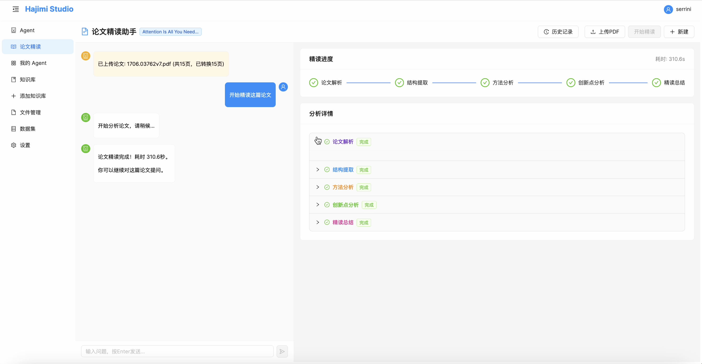

# Hajimi Paper Reader

[简体中文](#简体中文) | [English](#english)



## 简体中文

Hajimi Paper Reader 是一个本地优先的论文精读桌面应用，聚焦 PDF 预览、结构化论文分析、多轮问答和会话恢复。

### 主要能力

- PDF 上传并转为页面预览图
- 多 Agent 论文精读流程
- 精读完成后的论文问答
- 历史会话恢复
- 本地存储 PDF 与会话记录
- 登录、注册、游客登录

### Paper Reader

核心后端位于 `backend/agent/paper_reader/`。

这部分不是简单摘要，而是一套多 Agent 论文精读流程。它由 `Supervisor` 负责任务编排，再把工作分给几个专门的 Worker：

- `planner`：提取标题、作者、摘要、关键词等元信息
- `extractor`：整理章节结构与实验组织
- `analyzer`：分析方法设计与技术细节
- `critic`：分析创新点、局限性和改进方向
- `summarizer`：输出完整精读总结

#### PDF 预览界面


#### 精读分析流程界面


### 项目结构

- `frontend/`: 登录页与论文精读页面
- `backend/`: 认证、会话、PDF、论文精读 API
- `backend/agent/paper_reader/`: 多 Agent 精读引擎
- `docs/demo/`: README 使用的演示 GIF
- `electron/`: 桌面壳与前端打包脚本

### 运行要求

- Node.js 18+
- Python 3.11

### 安装依赖

在仓库根目录执行：

```bash
npm install
```

如果你只想单独准备前端：

```bash
npm --prefix frontend install
```

### 模型配置

默认通过环境变量提供模型配置。

至少需要准备：

- `LLM_API_URL`
- `LLM_API_KEY`
- `LLM_MODEL`

可先复制示例文件：

```bash
cp .env.example .env
```

### 开发

后端：

```bash
cd backend
python3 app.py
```

前端：

```bash
cd frontend
npm start
```

如果使用 Electron 集成开发流程：

```bash
npm run dev
```

### 数据存储

运行时数据默认保存在用户目录：

- macOS/Linux: `~/.hajimi_paper_reader/data/`
- Windows: `C:\Users\<YourUsername>\.hajimi_paper_reader\data\`

主要内容包括：

- `agent.db`
- `storage/papers/`

### 许可证

本项目基于 MIT License 开源，详见 [LICENSE](LICENSE)。

---

## English

Hajimi Paper Reader is a local-first desktop app focused on paper reading, with PDF preview, structured analysis, follow-up chat, and session recovery.

### Core Features

- PDF upload and page preview generation
- Multi-agent paper reading workflow
- Follow-up Q&A after reading
- Conversation history and recovery
- Local PDF and message persistence
- Login, register, and guest access

### Paper Reader

The core backend logic lives in `backend/agent/paper_reader/`.

Instead of using a single summarization prompt, the app runs a structured multi-agent workflow coordinated by a `Supervisor`:

- `planner`: extracts title, authors, abstract, and other metadata
- `extractor`: reconstructs the paper structure
- `analyzer`: focuses on methods and technical details
- `critic`: evaluates novelty, limitations, and improvement directions
- `summarizer`: produces the final reading summary

#### PDF Preview


#### Deep Reading Analysis Flow


### Project Structure

- `frontend/`: login and paper reader UI
- `backend/`: auth, conversations, PDF, and paper-reading APIs
- `backend/agent/paper_reader/`: multi-agent reading engine
- `docs/demo/`: demo GIF assets used by this README
- `electron/`: desktop shell and packaging scripts

### Requirements

- Node.js 18+
- Python 3.11

### Install Dependencies

From the repository root:

```bash
npm install
```

Frontend only:

```bash
npm --prefix frontend install
```

### Model Configuration

Model access is configured through environment variables by default.

At minimum, configure:

- `LLM_API_URL`
- `LLM_API_KEY`
- `LLM_MODEL`

You can start from:

```bash
cp .env.example .env
```

### Development

Backend:

```bash
cd backend
python3 app.py
```

Frontend:

```bash
cd frontend
npm start
```

Electron workflow:

```bash
npm run dev
```

### Data Storage

Runtime data is stored in the user directory:

- macOS/Linux: `~/.hajimi_paper_reader/data/`
- Windows: `C:\Users\<YourUsername>\.hajimi_paper_reader\data\`

Main files and folders:

- `agent.db`
- `storage/papers/`

### License

This project is licensed under the MIT License. See [LICENSE](LICENSE).
